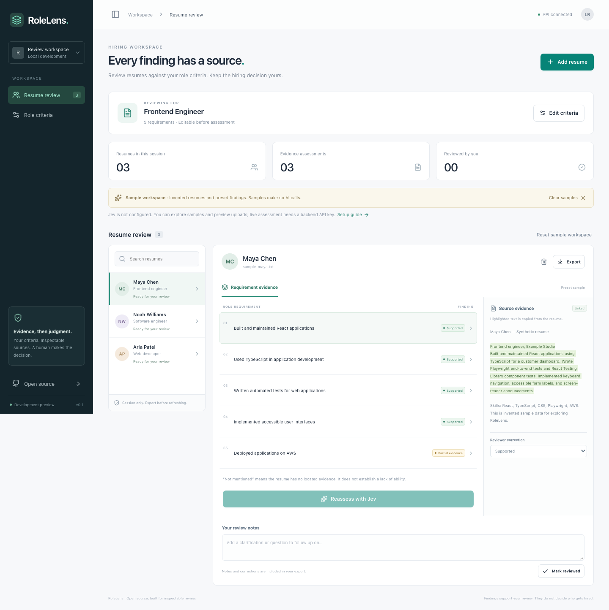

# RoleLens

Evidence-based resume review, built to self-host.

RoleLens helps reviewers compare what a resume says against explicit job requirements. Each finding should link to its source text and distinguish supporting evidence, partial evidence, missing mentions, and uncertainty. Reviewers retain the hiring decision.



## Project status

Active development. This first version is a **local development preview**, not an enterprise-ready release. It has no authentication or persistent database. Review data stays in the current browser session and is lost on refresh; export your work before closing it. Do not expose this version to a shared or public network.

## Direction

- Next.js, React, and TypeScript for the reviewer workspace.
- FastAPI and Python for document parsing and assessment.
- Jev for narrow, typed evidence judgments through a replaceable provider interface.
- Docker Compose for a reproducible local deployment.

Self-hosting the application does not imply local model inference: using the hosted Jev provider sends resume passages and requirements to TypeSafe. See [architecture and data handling](docs/architecture.md).

## What works today

- Editable role requirements, cleared assessments when criteria change.
- PDF, DOCX, and TXT upload with extracted text preview; pasted text is also supported.
- An explicitly labeled synthetic sample workspace that needs no API key.
- Jev evidence selection and assessment behind a replaceable provider interface.
- Source highlighting, reviewer corrections, notes, and CSV export.
- Reproducible dependency locks, automated checks, and browser tests.

## Run locally

Requires Node.js 22.13 or newer, Python 3.12–3.14, and [uv](https://docs.astral.sh/uv/). CI uses Node.js 24 and Python 3.13.

From the repository root:

```sh
npm ci
```

In a terminal for the backend:

```sh
cd apps/api
uv sync --frozen
cp .env.example .env
uv run uvicorn rolelens.main:app --reload --host 127.0.0.1 --port 8000
```

In another terminal, from the repository root:

```sh
npm run dev
```

Open [localhost:3000](http://localhost:3000). API documentation is at [localhost:8000/docs](http://localhost:8000/docs). Samples load automatically and make no model calls. Uploading a document parses it locally; assessment is a separate action.

## Configuration

For live assessment, set `TYPESAFE_API_KEY` in `apps/api/.env` and restart FastAPI. The key remains on the backend. Configure `TYPESAFE_MODEL` to pin a model version if needed. `MODEL_CONFIDENCE_FLOOR` defaults to `0.65` and needs validation on your own evaluation set.

If FastAPI runs somewhere else, copy `apps/web/.env.example` to `apps/web/.env.local`, set `API_BASE_URL`, and restart Next.js. This is a server-side value, not a public browser setting.

## Docker Compose

For a localhost-only deployment:

```sh
cp .env.example .env
docker compose up --build
```

Set the root `.env` key before starting if live assessment is wanted. The web port binds to `127.0.0.1:3000`; the backend has no published port. No application data volume is created in this development version.

## Checks

From the repository root:

```sh
npm run format:check
npm run lint
npm run typecheck
npm test
npm run build
npx playwright install chromium
npm run test:e2e
```

Browser tests start both applications automatically unless they are already running locally. From `apps/api`:

```sh
uv run ruff check .
uv run ruff format --check .
uv run pytest
```

Provider integration tests mock TypeSafe responses and never use a real key. Sample UI findings are fixtures, not model accuracy results. No live Jev accuracy benchmark has been published yet.

## Contributing

Read [CONTRIBUTING.md](CONTRIBUTING.md). We welcome reproducible bug reports, documentation fixes, and focused pull requests. Use synthetic resumes in public examples and reports.

## License

[MIT](LICENSE).
