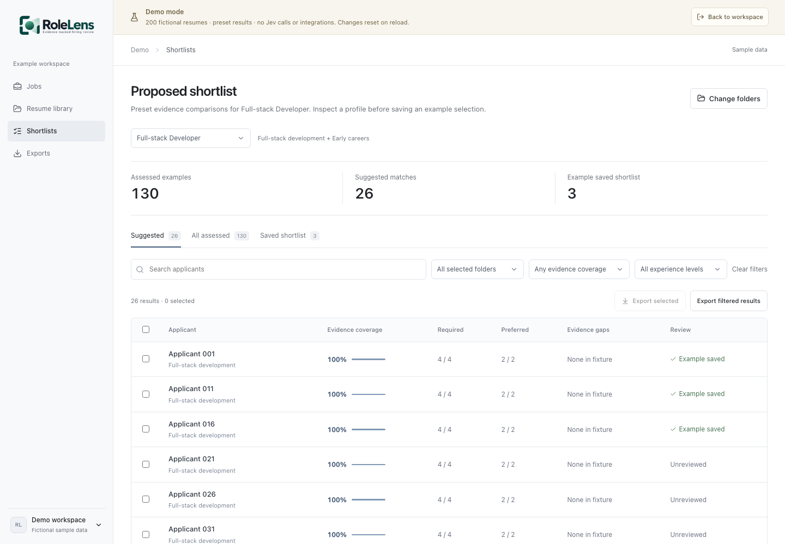

<picture>
  <source media="(prefers-color-scheme: dark)" srcset="apps/web/assets/logo%20-%202.png">
  <source media="(prefers-color-scheme: light)" srcset="apps/web/assets/logo%20-%201.png">
  
</picture>

# RoleLens

Self-hostable resume evidence review with automated application intake.

[](docs/demo.md)

[Explore the demo workspace](docs/demo.md). The screenshot shows fictional profiles and preset results, not live Jev screening.

Create a job once, receive applications from an external source or import many resumes together, and let a separate worker extract text and assess explicit role requirements. Reviewers inspect source evidence, correct findings, save notes, and export a review. RoleLens does not rank applicants or make hiring decisions.

## Current capabilities

- Dedicated Jobs, Resume library, and Exports navigation, with a workspace profile menu.
- An isolated demo with 200 fictional profiles, folders, example jobs, and preset shortlist comparisons; no API or Jev key required.
- Persistent jobs, applications, processing status, and reviewer work.
- Bulk file selection with three concurrent uploads, individual errors, safe retry receipts, and duplicate detection.
- An authenticated text/file intake API with source IDs and status receipts.
- A [runnable careers-form integration](docs/integrations.md). Named ATS connectors are not implemented yet.
- A database-backed worker with expiring leases, restart recovery, provider backoff, and bounded retry attempts.
- Local English OCR for scanned PDFs, with extraction provenance shown to reviewers.
- Server-side search, status filters, and 50-row pagination; resume text loads only when selected.
- Original model findings stored separately from reviewer corrections, with stale-write protection.
- CSV exports for one review, all reviewed applications, or all applications in a job.
- PostgreSQL and migrations in Compose; SQLite for local development.

## Deployment status

This is an active **local development preview**, not a completed enterprise deployment. The programmatic intake API has its own bearer token; the human reviewer UI has no login, workspace permissions, or tenant isolation. Keep the deployment on localhost or a trusted isolated development network. Shared/public use requires those controls, retention administration, and operational validation.

Real job records persist across refreshes and restarts. The [demo workspace](http://localhost:3000/demo) is separate, uses fictional presets, and resets on reload. Open it from the workspace profile menu and return using its banner. Folder-based matching and proposed shortlists are currently demo previews; real imports remain scoped to a job. Review the [data handling and queue guarantees](docs/architecture.md) before importing candidate information. Hosted assessment sends passages and requirements to TypeSafe.

## Run locally

Requires Node.js 22.13+, Python 3.12–3.14, and [uv](https://docs.astral.sh/uv/). CI uses Node.js 24 and Python 3.13.

From the root:

```sh
npm ci
```

Backend terminal:

```sh
cd apps/api
uv sync --frozen
cp .env.example .env
uv run alembic upgrade head
uv run uvicorn rolelens.main:app --reload --host 127.0.0.1 --port 8000
```

Worker terminal:

```sh
cd apps/api
uv run python -m rolelens.worker
```

Frontend terminal, from the root:

```sh
npm run dev
```

Open [localhost:3000](http://localhost:3000). Create a job, enter explicit requirements, then select multiple PDF/DOCX/TXT files with **Import resumes**. Accepted applications are durable; keep the tab open until all file uploads complete. Parsed documents wait for provider configuration when no Jev key exists. API documentation: [localhost:8000/docs](http://localhost:8000/docs).

For scanned PDFs, install Tesseract with English language data (`brew install tesseract` on supported macOS setups, or `sudo apt-get install tesseract-ocr tesseract-ocr-eng` on Debian/Ubuntu). Compose includes it. Text PDFs, DOCX, and TXT do not need the OCR binary. OCR-derived text can contain transcription errors; reviewers should check the original source document.

See the [demo walkthrough](docs/demo.md) to explore example folders, jobs, comparison results, and exports. The recorded video above shows the earlier intake/review interface.

## Configuration

Set `TYPESAFE_API_KEY` in `apps/api/.env` for automatic live assessments. Restart **both API and worker** after changing configuration. New and waiting applications then process automatically, sending resume passages and requirements to hosted Jev; calls may incur provider charges. The key is never sent to the browser.

`DATABASE_URL` defaults to `sqlite:///./data/rolelens.db`. `TYPESAFE_MODEL` defaults to `jev-latest`; pin a version for evaluations. `MODEL_CONFIDENCE_FLOOR=0.65` is an uncalibrated development default. Worker leases default to 90 seconds, renewed during processing; four attempts are allowed before automatic retries stop.

Set a separate long random `INTAKE_API_KEY` to enable server-to-server integration endpoints. Empty disables them. See [integration setup](docs/integrations.md). Changing a job's criteria requires creating a new job in this version; criteria are fixed so accepted applications use the same definition.

If FastAPI runs elsewhere, copy `apps/web/.env.example` to `apps/web/.env.local` and change server-side `API_BASE_URL`.

## Docker Compose

```sh
cp .env.example .env
docker compose up --build
```

Compose starts PostgreSQL, runs migrations once, and starts the API, worker, and Next.js. The web port binds to `127.0.0.1:3000`; database and API ports are unpublished. The `database` volume **contains candidate data** and survives `docker compose down`. Back it up and manage retention appropriately. Removing that volume erases the records.

Default PostgreSQL credentials are for isolated local development. If changing `POSTGRES_PASSWORD`, also update the password in `DATABASE_URL`, using URL encoding where necessary. The worker can be replicated with `docker compose up --scale worker=2`; provider quotas and performance need validation for the intended workload.

## Checks

From the repository root:

```sh
npm run format:check
npm run lint
npm run typecheck
npm test
npm run build
npx playwright install chromium
npm run test:e2e
```

Browser tests start isolated API, worker, careers-form, and Next.js processes on ports 8010, 9010, and 3010. They use a temporary database and synthetic credentials, and never call Jev. From `apps/api`:

```sh
uv run ruff check . ../../examples/careers-form/app.py
uv run ruff format --check . ../../examples/careers-form/app.py
uv run pytest
uv run alembic check
```

CI repeats intake tests against PostgreSQL, checks container startup, and runs `scripts/check_intake.py` to deliver and process 1,000 synthetic text applications through the actual API and worker with Jev disabled. The 1,000-application test verifies persistence, pagination, and metadata retrieval; it is not a production capacity or live-model accuracy benchmark. Provider tests mock responses. No live Jev quality or throughput evaluation has been published.

## Contributing

Read [CONTRIBUTING.md](CONTRIBUTING.md). Use invented candidate information in public examples, screenshots, tests, and reports. Focus contributions on a real intake/review problem and describe failure behavior as well as the happy path.

## License

[MIT](LICENSE).
