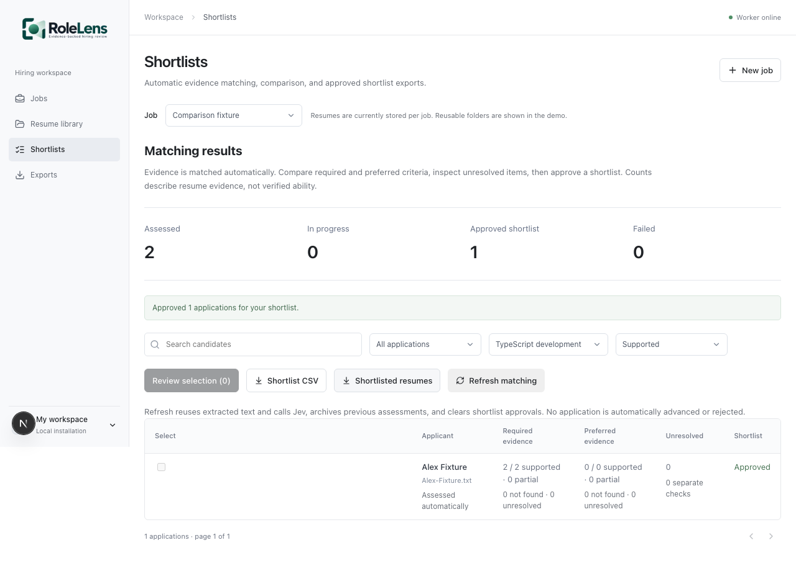

# Automatic matching and shortlist workflow

Import resumes into a job. Workers extract text and automatically assess each saved requirement. Open **Shortlists**, or **View matching results** from the resume library, to compare evidence counts and filter by an individual criterion. Select applications, inspect the evidence and unresolved items, and approve a shortlist. Export the approved CSV or original documents as a ZIP. Approval does not require manually scoring every criterion; the saved model findings remain inspectable and correctable.

RoleLens automates evidence processing. It does not automatically select, advance, or reject people, or claim that a resume establishes verified ability. Counts are explicit supported/partial/not-found/unresolved criteria, separated by required and preferred importance; they are not a composite fit score or a probability of successful hiring. The “all required evidence supported” filter includes every required criterion, including those needing separate verification. A communication/interview criterion can therefore keep an application outside that filter. Criterion filters offer narrower comparisons without hiding that uncertainty.

## Research behind the matcher

[TypeSafe's Jev 1.13 guidance](https://docs.typesafe.ai/model-jaggedness/jev-1.13) identifies literal interpretation, compound judgments, date arithmetic, and irrelevant context as failure modes. This implementation uses narrow questions about selected source passages; code owns ALL/ANY aggregation and date arithmetic. It does not ask Jev to generate explanations. The displayed explanations describe the code's method and available evidence.

[Greenhouse's AI principles](https://www.greenhouse.com/ai-principles) and [structured scorecard guidance](https://support.greenhouse.io/hc/en-us/articles/360007247412-Structured-hiring-Scorecard-definitions) support explicit job-related criteria and human ownership of candidate decisions. These informed the comparison workflow. This is a design rationale, not a claim that RoleLens matches another product's performance or compliance.

## What is automatic

1. OpenAI interprets the JD once into source-linked requirements. Prompt `jd-interpretation-v6` also proposes simple ALL/ANY components, preserving constraints and alternatives. The job definition is reviewed once before saving. Strict schemas, source checks, and Jev verification reduce errors without proving the interpretation correct.
2. Code retrieves up to three relevant extracted passages per component. Each passage receives a narrow Jev question. Small batches of 24 questions limit context distraction. Model choices and distributions are validated; malformed responses fail instead of becoming positive evidence.
3. Code combines component statuses. React **and** TypeScript requires supported applied-work evidence for both. SQL **or** NoSQL can be supported by either. A literal skills-list mention is partial evidence, never proof of applied experience. Missing named signals refer only to extracted text, not absent ability.
4. For simple minimum-years requirements, code parses explicit employment date ranges, asks Jev whether each employment block establishes the requested scope, then unions relevant intervals. Overlapping roles count once. Unknown months/days produce conservative whole-month bounds. A general “five years in industry” summary is insufficient for “four years full stack.” Education, personal projects, mixed thresholds, and exemptions do not become automatic tenure calculations.
5. A paginated SQL query returns comparison metadata without loading all source documents. Criterion filters, search, unresolved filters, and approved-shortlist filters work on saved summaries.

`WORKER_CONCURRENCY` defaults to two applications per worker, configurable from one to eight. Additional workers retain the existing transaction/lease protections. Each application may make several hosted requests; this change is not a validated production throughput benchmark. [TypeSafe's model limits](https://docs.typesafe.ai/models) still apply. There is no global quota coordinator across worker replicas.

## Refreshes and exports

Older assessments are labeled **Refresh needed** and cannot be newly approved until refreshed. **Refresh matching** reuses extracted text, queues live Jev assessment, archives previous findings/corrections/approval snapshots, and clears stale shortlist approvals. It preserves the job definition and resume text; it does not rerun OCR. An OCR fix requires a corrected document/import. Concurrent review and approval writes use record versions and reject stale updates.

Original uploads are retained in the database for downloads. The queue's parsing copy is still cleared after extraction. Files imported before this change may have no retained original; downloads report that honestly. ZIP exports contain only explicitly approved applications and are bounded to 100 documents and 50 MB. CSV exports include evidence counts and approval status; values are escaped against spreadsheet formula injection. Neither the filename-derived applicant label nor an OCR transcript should be treated as a verified identity.

The database and backups now retain original files, extracted text, assessments, history, and approvals. Operators must establish access and retention policies. Deletion/retention administration, authenticated editor identities, tenant permissions, and a complete audit history are not implemented. Workspace endpoints use a server-held token, but the development browser proxy does not provide user login. Keep this preview isolated rather than exposing it as an enterprise service.

## Known limits and validation

The fallback for older jobs uses a finite technical alias registry. Unknown skills and nested boolean expressions remain whole semantic conditions. Retrieval can miss evidence; English headings/date formats and OCR errors can leave tenure unresolved. Generic criteria are not declared globally absent from only a retrieved subset. Injection boundaries and obvious-pattern exclusion are defenses with tests, not a complete adversarial guarantee. Four source interpretations already flagged for verification in an older job remain flagged; refreshing evidence does not silently rewrite that job's criteria.

Unit/integration tests cover logical groups, missing components, uncertain responses, negation, injection examples, overlapping dates, non-employment exclusions, stale approvals, cross-job atomicity, authorization, document retention, correction-aware filters, and worker concurrency. Browser tests use fictional persisted records and exercise filtering, evidence review, approval, CSV/ZIP downloads, and narrow screens with hosted calls disabled. PostgreSQL CI repeats intake and comparison endpoint checks.

Small live smoke trials can establish that the provider integration runs, but cannot establish accuracy, fairness, hiring quality, or cost/latency superiority. Those claims need a separately labeled evaluation dataset, pinned model versions, measured provider usage, and suitable assessment of errors. Do not publish the user's real resumes as benchmark fixtures.
