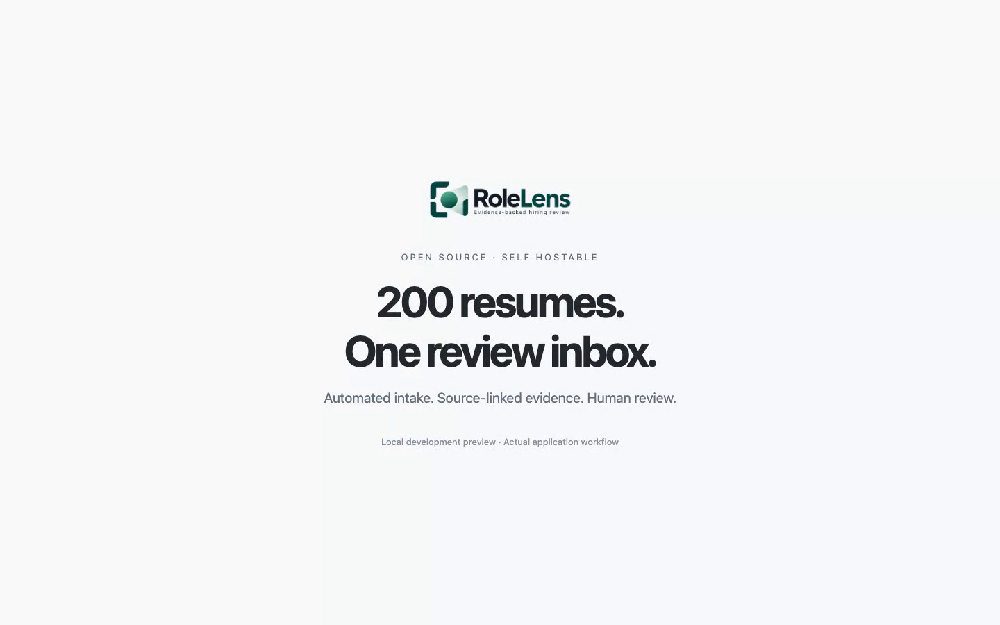

# Explore the demo workspace

Start the frontend with `npm ci` and `npm run dev`, then open [localhost:3000/demo](http://localhost:3000/demo). The demo works without the API, worker, or TypeSafe credentials.

From your regular workspace, open the **workspace profile** at the bottom of the sidebar and choose **Open demo**. On a phone, the profile control appears beside the logo. A persistent banner identifies demo mode and provides **Back to workspace**. Returning restores the workspace route and selected job; demo data is never imported into its database.

## What is included

- 200 invented resume profiles with text previews, organized into Full-stack development (80), Cloud engineering (70), and Early careers (50).
- Two example jobs: Full-stack Developer and Cloud Engineer, with descriptions, experience context, required criteria, and preferred criteria.
- Prepared comparison results, folder selection, evidence metrics, filters, profile review, example saved shortlists, and CSV downloads.

These profiles are synthetic fixtures, not copies of downloaded candidate documents. PDF/DOCX filenames illustrate source formats; original documents are not bundled. A profile can download its invented resume as TXT.

## Try the workflow

1. Open **Resume library**, select a folder, search an applicant, and inspect a fictional resume.
2. Open **Jobs** and click **Shortlist** on an example job. Inspect its criteria and select one or more folders.
3. Click **Generate demo shortlist**. This loads deterministic preset comparisons and makes no Jev or integration calls.
4. In **Shortlists**, switch between Suggested, All assessed, and Saved shortlist. Filter by folder, evidence coverage, or experience, or search by applicant.
5. Open a profile, inspect its preset findings, and add or remove an example reviewer selection.
6. Select rows to **Export selected**, or **Export filtered results**. In **Exports**, download the entire saved shortlist or all assessment results.
7. Use **Back to workspace** in the banner or profile menu. Use **Reset demo** or reload to restore the fixtures.

Evidence coverage gives each supported criterion 1 point and partial evidence 0.5, divided by the number of criteria. Missing or unclear evidence contributes 0. This is an illustrative evidence summary, not model confidence, a suitability prediction, or a validated screening score. Suggestions require fixture support for every required criterion; all assessed profiles remain accessible. CSV rows label their fictional provenance and distinguish unreviewed suggestions from example reviewer selections.

## Current workspace capabilities

The regular workspace has **Jobs**, **Resume library**, and **Exports** navigation. Create a real job with explicit criteria, bulk-import PDF/DOCX/TXT files into that job, inspect processed evidence, save reviewer corrections and notes, and export reviewed or all application reviews as CSV. Keep the API and worker running for that workflow. See the [README](../README.md) and [careers-form integration](integrations.md).

Reusable resume folders, richer job descriptions, cross-job matching, live proposed shortlists, and original-document exports are demonstrated product directions, not completed backend features. The regular library still stores resumes per job. Demo mode never calls that backend or provides evidence of Jev screening accuracy.

## Earlier recorded intake demonstration

The [short video](demo-assets/rolelens-demo-short.mp4) records the previous intake/review interface, rather than this new demo workspace. That recording used 200 randomly sampled PDFs from mixed job categories: 199 processed through local OCR and live assessment, and one yielded too little readable text. Processing wait was cut and labeled; public detail views used an invented profile.

Those measurements describe a past workflow run, not the synthetic presets in this demo or a benchmark of accuracy, fairness, suitability, or production capacity. Raw dataset documents are not distributed with the project.
